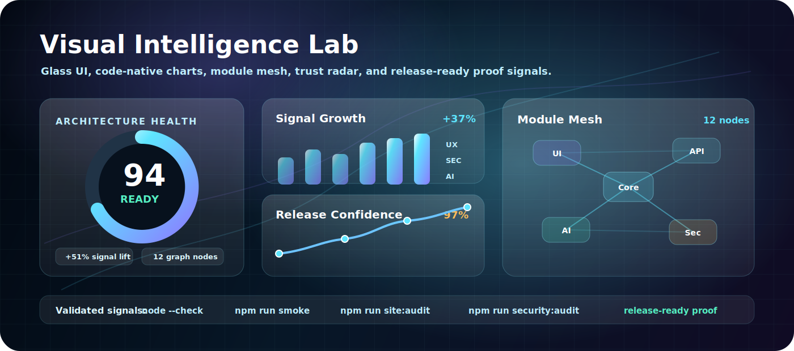
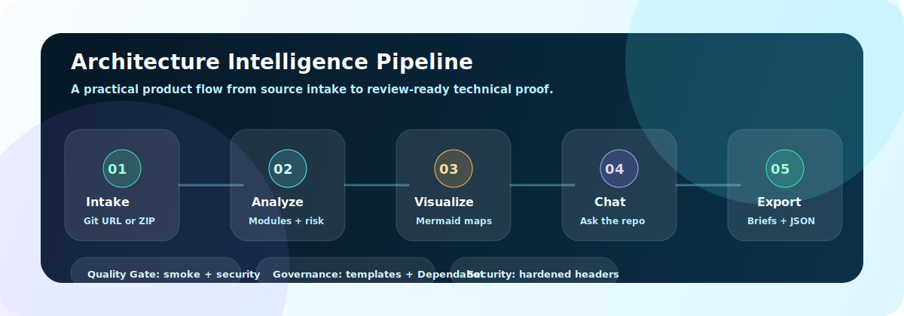
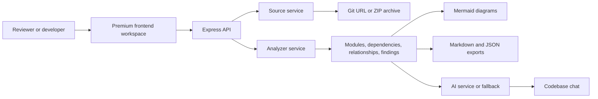

<p align="center">
  
</p>

<h1 align="center">LumenStack AI</h1>

<p align="center">
  <strong>An AI architecture intelligence workspace that turns repositories into system maps, quality signals, codebase chat, compare reviews, and export-ready engineering briefs.</strong>
</p>

<p align="center">
  <a href="https://lumenstack-ai.onrender.com/"><strong>Live Product</strong></a>
  &nbsp;&nbsp;|&nbsp;&nbsp;
  <a href="https://github.com/agarwalujala3-lang/LumenStack-AI/actions/workflows/smoke.yml"><strong>CI Quality Gate</strong></a>
  &nbsp;&nbsp;|&nbsp;&nbsp;
  <a href="https://ujala-portfolio-world.netlify.app/"><strong>Portfolio</strong></a>
  &nbsp;&nbsp;|&nbsp;&nbsp;
  <a href="https://www.linkedin.com/in/ujala-agarwal-30aa28283/"><strong>LinkedIn</strong></a>
</p>

<p align="center">
  <a href="https://github.com/agarwalujala3-lang/LumenStack-AI/actions/workflows/smoke.yml"></a>
  
  
  
  
  
</p>

<p align="center">
  
</p>

---

## What It Is

**LumenStack AI is a polished architecture review workspace for understanding software systems fast.** It accepts repositories or ZIP archives, analyzes code structure, detects architecture signals, generates Mermaid diagrams, enables codebase chat, compares baselines, and exports briefs that are ready for engineering or stakeholder review.

The project is built to demonstrate both product taste and engineering depth: a premium frontend, a real Express analysis backend, meaningful security checks, CI governance, and documentation that helps a reviewer see the complete system quickly.

## Product At A Glance

<table>
  <tr>
    <td><strong>Analyze</strong></td>
    <td>Read repositories, ZIP uploads, modules, dependencies, entrypoints, language mix, and platform signals.</td>
  </tr>
  <tr>
    <td><strong>Explain</strong></td>
    <td>Generate architecture summaries with OpenAI when configured, plus deterministic fallback output when no key is present.</td>
  </tr>
  <tr>
    <td><strong>Visualize</strong></td>
    <td>Create Mermaid architecture, sequence, class, and dependency diagrams from detected structure.</td>
  </tr>
  <tr>
    <td><strong>Review</strong></td>
    <td>Use compare mode, quality scores, hotspots, risk findings, platform radar, and chat to guide technical decisions.</td>
  </tr>
  <tr>
    <td><strong>Export</strong></td>
    <td>Download Markdown or JSON reports for reviewers, teammates, hiring panels, or release discussions.</td>
  </tr>
</table>

## Visual System

The interface is intentionally built like a modern AI product, not a plain analyzer form.

| Surface | Role |
| --- | --- |
| **Visual Intelligence Lab** | Glass dashboard with score ring, chart panels, module mesh, trust radar, and Quality/Security/Release modes. |
| **Architecture Cockpit** | Product-style system workspace for maps, evaluation, dependencies, issues, and reports. |
| **Proof Brief Layer** | Reviewer-ready evidence for UI polish, security posture, useful core, and deployment readiness. |
| **Live Analyzer** | Actual repository URL, ZIP upload, compare mode, chat, diagrams, and exports. |
| **Responsive Shell** | Desktop and mobile layouts tuned for readable hierarchy and stable controls. |

<p align="center">
  
</p>

## System Flow

<p align="center">
  
</p>



## Engineering Highlights

| Area | Implementation |
| --- | --- |
| **Backend** | Express app with analysis, chat, export, platform catalog, demo auth, saved project, and webhook routes. |
| **Analysis engine** | Language detection, module grouping, dependency parsing, relationship extraction, hotspot ranking, and quality scoring. |
| **Source handling** | Public Git URLs, generic HTTPS remotes, provider-aware workspace flows, and ZIP archive uploads. |
| **AI layer** | OpenAI integration with safe fallback summaries so the app still works without secrets. |
| **Frontend** | HTML, CSS, vanilla JavaScript, responsive product shell, command palette, motion, charts, and interactive mode states. |
| **Governance** | GitHub Actions, Dependabot, issue templates, PR template, security policy, contribution guide, and audit scripts. |

## Repository Structure

| Path | Purpose |
| --- | --- |
| [`src/app.js`](src/app.js) | Express app, security headers, routes, exports, demo APIs, and static serving. |
| [`src/services/analyzerService.js`](src/services/analyzerService.js) | Core repository intelligence engine. |
| [`src/services/sourceService.js`](src/services/sourceService.js) | Git and ZIP source preparation. |
| [`src/services/aiService.js`](src/services/aiService.js) | OpenAI and fallback explanation flow. |
| [`src/services/chatService.js`](src/services/chatService.js) | Grounded chat over analysis sessions. |
| [`public/index.html`](public/index.html) | Primary product experience and live analyzer surface. |
| [`public/styles.css`](public/styles.css) | Main visual system, layout, responsive rules, and glass UI layer. |
| [`public/site-actions.js`](public/site-actions.js) | UI actions, sharing, exports, use cases, and visual mode switching. |
| [`scripts/site-audit.js`](scripts/site-audit.js) | Static page, asset, and handled-button audit. |
| [`.github/workflows/smoke.yml`](.github/workflows/smoke.yml) | CI quality gate. |

## Quality Proof

| Check | Command | What it protects |
| --- | --- | --- |
| JavaScript syntax | `node --check public/site-actions.js` | Frontend interaction code parses cleanly. |
| Smoke test | `npm run smoke` | Analyzer works against this repository. |
| Site audit | `npm run site:audit` | Static pages, assets, and button handlers are valid. |
| Security audit | `npm run security:audit` | Security hardening expectations remain intact. |
| Diff hygiene | `git diff --check` | Whitespace and patch issues are caught before commit. |

## Tech Stack

| Layer | Technology |
| --- | --- |
| Runtime | Node.js 20+ |
| API | Express |
| Upload handling | Multer |
| Archive parsing | adm-zip |
| AI | OpenAI API with fallback summaries |
| Diagrams | Mermaid |
| Frontend | HTML, CSS, vanilla JavaScript |
| Visual layer | SVG assets, generated product imagery, CSS motion, tsParticles |
| CI and governance | GitHub Actions, Dependabot, templates, audits |
| Deployment | Render web service |

## Run Locally

```bash
npm install
cp .env.example .env
npm start
```

Windows PowerShell:

```powershell
npm install
Copy-Item .env.example .env
npm start
```

Open:

```text
http://localhost:3000
```

The app works without an OpenAI key. Add `OPENAI_API_KEY` to enable live AI explanations and chat.

## Environment

```env
OPENAI_API_KEY=
OPENAI_MODEL=gpt-5-mini
GITHUB_WEBHOOK_SECRET=
PORT=3000
```

| Variable | Required | Purpose |
| --- | --- | --- |
| `OPENAI_API_KEY` | No | Enables live AI explanations and codebase chat. |
| `OPENAI_MODEL` | No | Selects the model for live AI mode. |
| `GITHUB_WEBHOOK_SECRET` | No | Optional webhook signature secret. |
| `PORT` | No | Local server port. Render sets this in production. |

## API Surface

| Method | Route | Purpose |
| --- | --- | --- |
| `GET` | `/health` | Health check. |
| `GET` | `/api/platforms` | Supported provider catalog. |
| `POST` | `/api/auth/demo` | Demo recruiter sign-in. |
| `GET` | `/api/projects` | List saved demo projects. |
| `POST` | `/api/projects` | Save a demo architecture project. |
| `POST` | `/api/analyze` | Analyze a repository or uploaded ZIP. |
| `POST` | `/api/chat` | Ask questions against an analysis session. |
| `POST` | `/api/system-chat` | Ask product or system-level questions. |
| `GET` | `/api/export/:analysisId` | Export Markdown or JSON. |
| `POST` | `/api/github/webhook` | Store webhook-triggered reports. |

## Deployment

```text
Build command: npm install
Start command: npm start
Node version: 20+
```

Live product:

```text
https://lumenstack-ai.onrender.com/
```

Health check:

```text
https://lumenstack-ai.onrender.com/health
```

## Fast Review Path

1. Open the live product.
2. Scan the Visual Intelligence Lab and switch Quality, Security, and Release modes.
3. Run a public repository URL or upload a ZIP.
4. Review modules, dependencies, diagrams, findings, chat, and exports.
5. Inspect `src/services/analyzerService.js`, `src/app.js`, `public/site-actions.js`, and `.github/workflows/smoke.yml`.

## Roadmap

- Persistent saved projects with PostgreSQL, Supabase, or Neon.
- Authenticated private repository workspaces.
- Pull request review summaries and GitHub comment automation.
- Dependency risk enrichment with registry metadata.
- Historical quality trends across saved analyses.
- Team dashboard for architecture review workflows.

## Author

Built by **Ujala Agarwal**.

- Portfolio: <https://ujala-portfolio-world.netlify.app/>
- LinkedIn: <https://www.linkedin.com/in/ujala-agarwal-30aa28283/>
- GitHub: <https://github.com/agarwalujala3-lang>
- Email: <agarwalujala3@gmail.com>

## License

MIT. See [`LICENSE`](LICENSE).