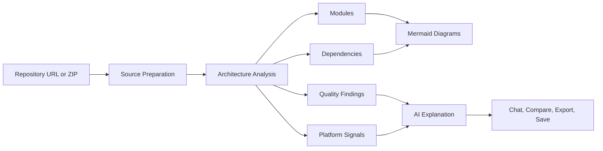

<p align="center">
  
</p>

<h1 align="center">LumenStack AI</h1>

<p align="center">
  <strong>AI architecture intelligence for repositories, diagrams, codebase chat, compare reviews, and stakeholder-ready briefs.</strong>
</p>

<p align="center">
  <a href="https://lumenstack-ai.onrender.com/">Live Demo</a>
  &nbsp;|&nbsp;
  <a href="https://github.com/agarwalujala3-lang/LumenStack-AI/actions/workflows/smoke.yml">Quality Gate</a>
  &nbsp;|&nbsp;
  <a href="https://agarwalujala3-lang.github.io/ujala-portfolio/">Portfolio</a>
  &nbsp;|&nbsp;
  <a href="https://www.linkedin.com/in/ujala-agarwal-30aa28283/">LinkedIn</a>
  &nbsp;|&nbsp;
  <a href="mailto:agarwalujala3@gmail.com">Email</a>
</p>

<p align="center">
  <a href="https://github.com/agarwalujala3-lang/LumenStack-AI/actions/workflows/smoke.yml"></a>
  
  
  
  
</p>

<p align="center">
  
</p>

---

## Executive Summary

LumenStack AI is a production-minded full-stack JavaScript project by **Ujala Agarwal**. It turns a repository URL or ZIP upload into a polished architecture intelligence workspace with module discovery, dependency analysis, quality findings, Mermaid diagrams, compare mode, codebase chat, exports, and recruiter-ready proof surfaces.

The project is built to be reviewed quickly by hiring teams and technical evaluators. It combines a premium SaaS-style frontend, an Express analysis backend, security-conscious browser headers, automated smoke/security checks, and clear GitHub documentation.

## Why This Repository Stands Out

| Reviewer signal | What it demonstrates |
| --- | --- |
| Product-grade UI | Advanced visual design, responsive dashboard surfaces, motion, and clear information hierarchy. |
| Real backend behavior | Express routes for analysis, chat, exports, platform catalog, demo auth, saved projects, and webhooks. |
| Architecture analysis | Source ingestion, module inference, dependency discovery, relationship mapping, and hotspot scoring. |
| AI workflow design | OpenAI-powered explanations where configured, plus graceful fallback summaries when no key is present. |
| Security awareness | Hardened response headers, upload constraints, webhook secret support, and a security audit script. |
| GitHub readiness | Quality workflow, issue templates, PR template, security policy, and contribution guide. |

## Live Product

- Live app: <https://lumenstack-ai.onrender.com/>
- Health endpoint: <https://lumenstack-ai.onrender.com/health>
- Social preview asset: [`public/social-preview.png`](public/social-preview.png)
- GitHub preview asset: [`public/lumenstack-github-preview.svg`](public/lumenstack-github-preview.svg)

## Core Workflow



## Feature Highlights

| Area | Capabilities |
| --- | --- |
| Source intake | Public Git repositories, generic HTTPS Git URLs, and ZIP uploads. |
| Architecture view | Modules, dependencies, relationships, entrypoints, language mix, and framework signals. |
| Diagrams | Architecture, sequence, class, and dependency diagrams rendered through Mermaid. |
| Quality review | Quality score, findings, hotspots, risky boundaries, and compare summaries. |
| AI assistance | Architecture explanation, system-level assistant, and codebase chat using stored analysis context. |
| Reports | Markdown and JSON export routes for stakeholder or recruiter briefs. |
| Product polish | Intro animation, visual intelligence deck, proof brief layer, cockpit preview, responsive UI, and theme support. |

## Tech Stack

| Layer | Technology |
| --- | --- |
| Runtime | Node.js 20+ |
| API | Express |
| Uploads | Multer |
| Archive parsing | adm-zip |
| AI | OpenAI API with fallback summaries |
| Diagrams | Mermaid |
| Frontend | HTML, CSS, Vanilla JavaScript |
| Visual effects | tsParticles, CSS motion, responsive product UI |
| CI | GitHub Actions quality gate |
| Deployment | Render web service |

## Repository Map

| Path | Purpose |
| --- | --- |
| [`src/app.js`](src/app.js) | Express app composition, routes, security headers, API surface, exports, and demo project APIs. |
| [`src/services/analyzerService.js`](src/services/analyzerService.js) | Core static analysis engine for modules, dependencies, relationships, languages, and findings. |
| [`src/services/sourceService.js`](src/services/sourceService.js) | Repository and ZIP source preparation. |
| [`src/services/aiService.js`](src/services/aiService.js) | OpenAI integration plus fallback explanation behavior. |
| [`src/services/chatService.js`](src/services/chatService.js) | Grounded chat responses against analysis sessions. |
| [`public/index.html`](public/index.html) | Primary product surface, live analyzer, proof sections, and recruiter-facing flow. |
| [`public/critical-ui.css`](public/critical-ui.css) | Late-loaded premium UI polish and responsive refinements. |
| [`public/site-actions.js`](public/site-actions.js) | Live actions for sharing, exporting, proof pitch copy, use-case launch, and UI feedback. |
| [`scripts/smoke-test.js`](scripts/smoke-test.js) | Repository self-analysis smoke test. |
| [`scripts/security-audit.js`](scripts/security-audit.js) | Security header and hardening audit. |
| [`scripts/site-audit.js`](scripts/site-audit.js) | Static page coverage and live-site structure audit. |

## Quick Start

```bash
npm install
cp .env.example .env
npm start
```

Windows PowerShell:

```powershell
npm install
Copy-Item .env.example .env
npm start
```

Open:

```text
http://localhost:3000
```

The app works without an OpenAI key by using deterministic fallback summaries. Add an API key only when live AI responses are needed.

## Environment Variables

```env
OPENAI_API_KEY=
OPENAI_MODEL=gpt-5-mini
GITHUB_WEBHOOK_SECRET=
PORT=3000
```

| Variable | Required | Purpose |
| --- | --- | --- |
| `OPENAI_API_KEY` | No | Enables live AI explanations and chat. Without it, fallback summaries are used. |
| `OPENAI_MODEL` | No | Model name for OpenAI requests. Defaults safely in app code if omitted. |
| `GITHUB_WEBHOOK_SECRET` | No | Optional signature secret for GitHub webhook report intake. |
| `PORT` | No | Local server port. Render injects this automatically in production. |

## Quality Gates

Run the same checks used to keep the project reviewable:

```bash
npm run smoke
npm run security:audit
npm run site:audit
```

GitHub Actions runs the quality workflow on pushes to `main` and pull requests. The workflow installs with `npm ci`, runs the smoke analysis, and runs the security audit.

## API Surface

| Method | Route | Purpose |
| --- | --- | --- |
| `GET` | `/health` | Service health check. |
| `GET` | `/api/platforms` | Supported repository provider catalog. |
| `POST` | `/api/auth/demo` | Demo recruiter sign-in. |
| `GET` | `/api/projects` | List saved demo projects. |
| `POST` | `/api/projects` | Save a demo architecture project. |
| `POST` | `/api/analyze` | Analyze a repository or uploaded ZIP. |
| `POST` | `/api/chat` | Ask questions against an analysis session. |
| `POST` | `/api/system-chat` | Ask product or system-level questions. |
| `GET` | `/api/export/:analysisId` | Export Markdown or JSON. |
| `POST` | `/api/github/webhook` | Store GitHub webhook-triggered reports. |

## Deployment

Recommended path: Render Web Service.

```text
Build command: npm install
Start command: npm start
Node version: 20+
```

Optional environment variables are listed in [Environment Variables](#environment-variables). The live app currently runs at <https://lumenstack-ai.onrender.com/>.

## Review Guide For Hiring Teams

1. Open the live demo and scan the first viewport for product clarity.
2. Use the visual intelligence and proof brief sections to understand the value proposition.
3. Run a repository URL or ZIP analysis.
4. Inspect generated modules, dependencies, diagrams, and findings.
5. Try compare mode and codebase chat.
6. Export a Markdown or JSON report.
7. Review `src/services/analyzerService.js`, `src/app.js`, and the GitHub workflow for implementation depth.

## Roadmap

- Persistent saved projects with PostgreSQL or Supabase.
- Authenticated workspaces for private repositories.
- Pull request comment summaries and review automation.
- Dependency risk enrichment with registry metadata.
- Team-facing project dashboards and historical trend tracking.

## Contributing

See [`CONTRIBUTING.md`](CONTRIBUTING.md) for local setup, branch naming, quality checks, and pull request expectations.

## Security

See [`SECURITY.md`](SECURITY.md) for supported reporting guidance and the current security posture.

## License

MIT. See [`LICENSE`](LICENSE).
