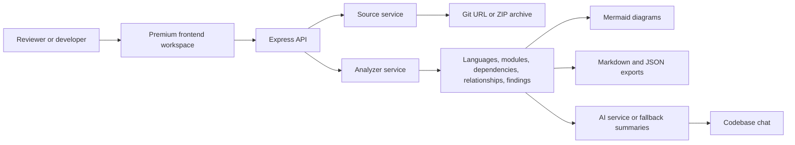

<p align="center">
  
</p>

<h1 align="center">LumenStack AI</h1>

<p align="center">
  <strong>Premium AI architecture intelligence for reading repositories like living systems: analyze, map, compare, explain, chat, and export decision-ready engineering briefs.</strong>
</p>

<p align="center">
  <a href="https://lumenstack-ai.onrender.com/"><strong>Live Product</strong></a>
  &nbsp;&nbsp;|&nbsp;&nbsp;
  <a href="https://github.com/agarwalujala3-lang/LumenStack-AI/actions/workflows/smoke.yml"><strong>Quality Gate</strong></a>
  &nbsp;&nbsp;|&nbsp;&nbsp;
  <a href="https://ujala-portfolio-world.netlify.app/"><strong>Portfolio</strong></a>
  &nbsp;&nbsp;|&nbsp;&nbsp;
  <a href="https://www.linkedin.com/in/ujala-agarwal-30aa28283/"><strong>LinkedIn</strong></a>
</p>

<p align="center">
  <a href="https://github.com/agarwalujala3-lang/LumenStack-AI/actions/workflows/smoke.yml"></a>
  
  
  
  
  
</p>

<p align="center">
  
</p>

<p align="center">
  
</p>

---

## Product Promise

**LumenStack AI turns any supported codebase into an architecture command center.** It brings repository intake, static analysis, AI explanations, Mermaid diagrams, compare review, codebase chat, security-conscious UX, and exportable briefs into one polished engineering workspace.

This is not a plain portfolio demo. It is designed like a real product review surface: premium frontend, useful backend, trust signals, governance files, CI checks, and a GitHub README that helps a reviewer understand the build in minutes.

<table>
  <tr>
    <td><strong>Product Signal</strong></td>
    <td>Glowing glass UI, visual intelligence lab, command palette, proof brief, architecture cockpit, responsive dashboard surfaces, and recruiter-friendly storytelling.</td>
  </tr>
  <tr>
    <td><strong>Engineering Signal</strong></td>
    <td>Express API, repository and ZIP analysis, module/dependency detection, quality findings, diagrams, chat, compare mode, exports, and clear service boundaries.</td>
  </tr>
  <tr>
    <td><strong>Trust Signal</strong></td>
    <td>Security headers, smoke test, site audit, security audit, GitHub Actions quality gate, Dependabot, issue templates, PR template, contribution guide, and security policy.</td>
  </tr>
</table>

## Latest Product Iteration

The latest upgrade pushes the app toward a higher-end AI product feel while keeping the interface useful and testable.

| Upgrade | What changed |
| --- | --- |
| **Visual Intelligence Lab** | Added a cinematic glass dashboard with control-room imagery, chart panels, module mesh, radar, and icon tiles. |
| **Interactive Modes** | Quality, Security, and Release tabs now update score, trend, radar, copy, and chart state in the real UI. |
| **Premium Asset Layer** | Added a generated product visual at `public/visual-lab-control-room.png` and connected it to the live landing page. |
| **Responsive Polish** | Desktop and mobile checks verified the section fits without horizontal overflow and keeps the visual hierarchy intact. |
| **Audit Coverage** | Updated the site audit so the new visual-mode buttons are recognized as handled controls. |

<p align="center">
  
</p>

## Why It Stands Out

| Dimension | Reviewer takeaway |
| --- | --- |
| **First impression** | Looks like a serious AI/SaaS product, not a student assignment or default template. |
| **Usefulness** | Actually analyzes repositories, extracts signals, generates diagrams, supports chat, and exports reports. |
| **Depth** | Covers architecture, dependencies, modules, platform signals, risk findings, compare mode, and decision briefs. |
| **Trust** | Ships with documented checks, CI, security policy, contribution guide, and audit scripts. |
| **Story** | The README, case study, proof layer, and visual UI make the project easy to understand quickly. |

## Core Capabilities

| Capability | Details |
| --- | --- |
| **Repository intake** | Accepts public Git repository URLs, generic HTTPS Git sources, and ZIP uploads. |
| **Static analysis** | Detects languages, files, modules, dependencies, relationships, entrypoints, framework signals, and platform clues. |
| **Quality intelligence** | Produces quality score, hotspots, findings, platform signals, and review summaries. |
| **Diagram generation** | Creates Mermaid architecture, sequence, class, and dependency diagrams. |
| **AI explanation** | Uses OpenAI when configured, with deterministic fallback summaries when no key is present. |
| **Codebase chat** | Answers questions against saved analysis context. |
| **Compare mode** | Compares current and baseline sources for review, migration, and release decisions. |
| **Exports** | Provides Markdown and JSON export routes for stakeholder-ready reports. |

## Experience Surfaces

| Surface | Purpose |
| --- | --- |
| **Cinematic intro** | Short 3-4 second branded start that sets a premium tone. |
| **Visual intelligence deck** | Code-native score, charts, mode switching, module graph, radar, and control-room asset. |
| **Architecture cockpit** | Product preview for evaluation, graph, issues, dependencies, and report workflows. |
| **Proof brief layer** | Reviewer-ready proof signals and copyable project pitch. |
| **Live analyzer** | Real repository URL, ZIP upload, compare mode, diagrams, chat, and exports. |
| **Saved projects demo** | Lightweight demo auth and saved review surface for product direction. |

## System Flow

<p align="center">
  
</p>



## Repository Map

| Path | Why it matters |
| --- | --- |
| [`src/app.js`](src/app.js) | Express app, routes, security headers, API orchestration, exports, demo project APIs, and static pages. |
| [`src/services/analyzerService.js`](src/services/analyzerService.js) | Core analysis engine for files, modules, dependencies, relationships, findings, language mix, and diagrams. |
| [`src/services/sourceService.js`](src/services/sourceService.js) | Repository clone and ZIP source preparation. |
| [`src/services/aiService.js`](src/services/aiService.js) | OpenAI integration with fallback architecture summaries. |
| [`src/services/chatService.js`](src/services/chatService.js) | Grounded chat over saved analysis context. |
| [`public/index.html`](public/index.html) | Primary product surface, visual intelligence lab, proof sections, and analyzer structure. |
| [`public/styles.css`](public/styles.css) | Core visual system, responsive layout, glass surfaces, animations, and premium UI polish. |
| [`public/site-actions.js`](public/site-actions.js) | Share/export actions, proof pitch copy, use-case actions, visual mode switching, and UI feedback. |
| [`scripts/site-audit.js`](scripts/site-audit.js) | Static site integrity audit for pages, assets, and handled buttons. |
| [`.github/workflows/smoke.yml`](.github/workflows/smoke.yml) | GitHub Actions quality gate for smoke and security checks. |

## Quality And Security Proof

| Check | Command | Purpose |
| --- | --- | --- |
| JavaScript syntax | `node --check public/site-actions.js` | Confirms the visual interaction layer parses cleanly. |
| Smoke analysis | `npm run smoke` | Runs the analyzer against this repository and reports platform signals. |
| Site audit | `npm run site:audit` | Checks 12 static pages, internal assets, and handled buttons. |
| Security audit | `npm run security:audit` | Verifies security hardening expectations. |
| Diff hygiene | `git diff --check` | Catches whitespace and patch integrity problems before commit. |

Recent validation after the visual intelligence upgrade:

```text
node --check public/site-actions.js
npm run smoke
npm run site:audit
npm run security:audit
```

The repository also includes `.github` issue templates, a pull request template, Dependabot configuration, `CONTRIBUTING.md`, `SECURITY.md`, and MIT licensing.

## Tech Stack

| Layer | Technology |
| --- | --- |
| Runtime | Node.js 20+ |
| API | Express |
| Uploads | Multer |
| Archive parsing | adm-zip |
| AI | OpenAI API with fallback summaries |
| Diagrams | Mermaid |
| Frontend | HTML, CSS, Vanilla JavaScript |
| Motion and visuals | CSS motion, tsParticles, SVG graphics, generated product imagery |
| CI and governance | GitHub Actions, Dependabot, templates, audits |
| Deployment | Render web service |

## Quick Start

```bash
npm install
cp .env.example .env
npm start
```

Windows PowerShell:

```powershell
npm install
Copy-Item .env.example .env
npm start
```

Open:

```text
http://localhost:3000
```

The app runs without an OpenAI key. Live AI features activate when `OPENAI_API_KEY` is configured.

## Environment Variables

```env
OPENAI_API_KEY=
OPENAI_MODEL=gpt-5-mini
GITHUB_WEBHOOK_SECRET=
PORT=3000
```

| Variable | Required | Purpose |
| --- | --- | --- |
| `OPENAI_API_KEY` | No | Enables live AI explanations and codebase chat. |
| `OPENAI_MODEL` | No | Model used when live AI is enabled. |
| `GITHUB_WEBHOOK_SECRET` | No | Optional signature secret for GitHub webhook report intake. |
| `PORT` | No | Local server port. Render sets this automatically in production. |

## API Surface

| Method | Route | Purpose |
| --- | --- | --- |
| `GET` | `/health` | Service health check. |
| `GET` | `/api/platforms` | Supported provider catalog. |
| `POST` | `/api/auth/demo` | Demo recruiter sign-in. |
| `GET` | `/api/projects` | List saved demo projects. |
| `POST` | `/api/projects` | Save a demo architecture project. |
| `POST` | `/api/analyze` | Analyze a repository or uploaded ZIP. |
| `POST` | `/api/chat` | Ask questions against an analysis session. |
| `POST` | `/api/system-chat` | Ask product or system-level questions. |
| `GET` | `/api/export/:analysisId` | Export Markdown or JSON. |
| `POST` | `/api/github/webhook` | Store GitHub webhook-triggered reports. |

## Deployment

Recommended path: **Render Web Service**.

```text
Build command: npm install
Start command: npm start
Node version: 20+
```

Live deployment:

```text
https://lumenstack-ai.onrender.com/
```

Health check:

```text
https://lumenstack-ai.onrender.com/health
```

## Fast Review Path

1. Open the live product and scan the first viewport.
2. Scroll to the Visual Intelligence Lab and switch Quality, Security, and Release modes.
3. Try a public repository URL or upload a ZIP.
4. Inspect modules, dependencies, diagrams, findings, chat, and exports.
5. Review `src/services/analyzerService.js`, `src/app.js`, `public/site-actions.js`, and `.github/workflows/smoke.yml`.

## Roadmap

- Persistent saved projects with PostgreSQL, Supabase, or Neon.
- Authenticated private repository workspaces.
- Pull request review summaries and GitHub comment automation.
- Dependency risk enrichment with registry metadata.
- Historical quality trends across saved analyses.
- Team dashboard for architecture review workflows.

## Author

Built by **Ujala Agarwal**.

- Portfolio: <https://ujala-portfolio-world.netlify.app/>
- LinkedIn: <https://www.linkedin.com/in/ujala-agarwal-30aa28283/>
- GitHub: <https://github.com/agarwalujala3-lang>
- Email: <agarwalujala3@gmail.com>

## Contributing And Security

- Contribution guide: [`CONTRIBUTING.md`](CONTRIBUTING.md)
- Security policy: [`SECURITY.md`](SECURITY.md)
- License: [`MIT`](LICENSE)