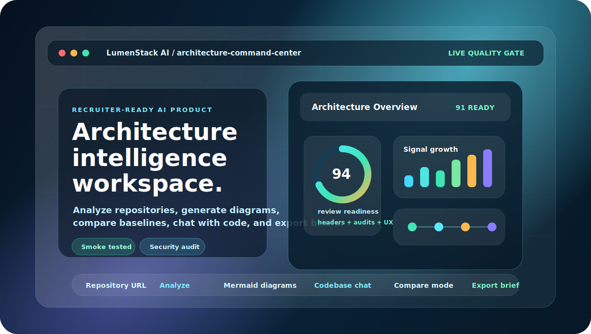
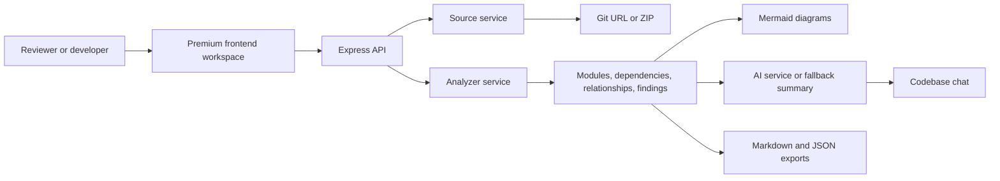

<p align="center">
  
</p>

<h1 align="center">LumenStack AI</h1>

<p align="center">
  <strong>A high-end AI architecture intelligence workspace for repository analysis, diagrams, codebase chat, compare reviews, and stakeholder-ready engineering briefs.</strong>
</p>

<p align="center">
  <a href="https://lumenstack-ai.onrender.com/"><strong>Live Demo</strong></a>
  &nbsp;&nbsp;|&nbsp;&nbsp;
  <a href="https://github.com/agarwalujala3-lang/LumenStack-AI/actions/workflows/smoke.yml"><strong>Quality Gate</strong></a>
  &nbsp;&nbsp;|&nbsp;&nbsp;
  <a href="https://ujala-portfolio-world.netlify.app/"><strong>Portfolio</strong></a>
  &nbsp;&nbsp;|&nbsp;&nbsp;
  <a href="https://www.linkedin.com/in/ujala-agarwal-30aa28283/"><strong>LinkedIn</strong></a>
</p>

<p align="center">
  <a href="https://github.com/agarwalujala3-lang/LumenStack-AI/actions/workflows/smoke.yml"></a>
  
  
  
  
</p>

<p align="center">
  
</p>

---

## The Product In One Line

**LumenStack AI turns a repository into a polished architecture command center: source intake, static analysis, quality signals, AI explanation, Mermaid diagrams, codebase chat, compare mode, and exportable technical briefs.**

It is built as a serious portfolio-grade product: the interface looks like a premium SaaS dashboard, the backend performs real repository analysis, and the GitHub repo is packaged with quality gates, security notes, contribution guidance, issue templates, and Dependabot governance.

<table>
  <tr>
    <td><strong>Product Signal</strong></td>
    <td>Advanced responsive frontend with visual intelligence, proof brief, cockpit preview, polished motion, and recruiter-friendly story.</td>
  </tr>
  <tr>
    <td><strong>Engineering Signal</strong></td>
    <td>Express API, repository/ZIP source handling, static analysis services, grounded chat, exports, and clear route boundaries.</td>
  </tr>
  <tr>
    <td><strong>Trust Signal</strong></td>
    <td>Security headers, smoke test, security audit, GitHub Actions quality gate, Dependabot, security policy, and PR/issue templates.</td>
  </tr>
</table>

## High-End Frontend Experience

The frontend is designed to feel like a real architecture intelligence product, not a plain demo page.

| Surface | What the reviewer sees |
| --- | --- |
| **Cinematic intro** | A short 3-4 second branded startup moment that sets the product tone. |
| **Architecture cockpit** | A SaaS-style command workspace with system map, AI evaluation, components, and issue surfaces. |
| **Visual intelligence deck** | Animated health score, chart bars, module mesh, and security/audit icon tiles. |
| **Proof brief layer** | Recruiter-ready proof signals, release rail, review-readiness score, and copyable project pitch. |
| **Live analyzer** | Real form controls for repository URL, ZIP uploads, compare mode, diagrams, chat, and exports. |
| **Responsive polish** | Desktop and mobile layouts are validated for fit, interaction, and readable hierarchy. |

<p align="center">
  
</p>

## What LumenStack AI Actually Does

| Capability | Details |
| --- | --- |
| **Repository intake** | Accepts public Git repository URLs, generic HTTPS Git sources, and ZIP uploads. |
| **Static analysis** | Detects languages, files, modules, dependencies, relationships, entrypoints, and framework signals. |
| **Quality intelligence** | Produces quality score, hotspots, structural findings, platform signals, and review summaries. |
| **Diagram generation** | Creates Mermaid architecture, sequence, class, and dependency diagrams. |
| **AI explanation** | Uses OpenAI when configured, with deterministic fallback summaries when no key is present. |
| **Codebase chat** | Answers questions against stored analysis context. |
| **Compare mode** | Compares current and baseline sources to support review, migration, and release decisions. |
| **Exports** | Provides Markdown and JSON export routes for stakeholder-ready reports. |

## Architecture At A Glance



## Repository Map

| Path | Why it matters |
| --- | --- |
| [`src/app.js`](src/app.js) | Main Express app, routes, security headers, API orchestration, exports, and demo project APIs. |
| [`src/services/analyzerService.js`](src/services/analyzerService.js) | Core analysis engine for modules, dependencies, relationships, language mix, findings, and diagrams. |
| [`src/services/sourceService.js`](src/services/sourceService.js) | Repository clone and ZIP source preparation. |
| [`src/services/aiService.js`](src/services/aiService.js) | OpenAI integration with fallback architecture summaries. |
| [`src/services/chatService.js`](src/services/chatService.js) | Grounded chat behavior using saved analysis context. |
| [`public/index.html`](public/index.html) | Primary product surface and live analyzer structure. |
| [`public/critical-ui.css`](public/critical-ui.css) | Premium visual system refinements loaded after the base stylesheet. |
| [`public/site-actions.js`](public/site-actions.js) | Sharing, exporting, proof pitch copy, use-case actions, and UI feedback. |
| [`.github/workflows/smoke.yml`](.github/workflows/smoke.yml) | GitHub Actions quality gate for smoke and security checks. |

## Quality And Security Proof

| Check | Command | Purpose |
| --- | --- | --- |
| Smoke analysis | `npm run smoke` | Runs the analyzer against this repository and reports platform signals. |
| Security audit | `npm run security:audit` | Verifies security hardening expectations. |
| Site audit | `npm run site:audit` | Checks static pages and live-site structure. |
| CI install safety | `npm ci` | Used by GitHub Actions for clean dependency installation. |

The repository also includes:

- `.github/PULL_REQUEST_TEMPLATE.md`
- `.github/ISSUE_TEMPLATE/bug_report.yml`
- `.github/ISSUE_TEMPLATE/feature_request.yml`
- `.github/dependabot.yml`
- `CONTRIBUTING.md`
- `SECURITY.md`

## Tech Stack

| Layer | Technology |
| --- | --- |
| Runtime | Node.js 20+ |
| API | Express |
| Uploads | Multer |
| Archive parsing | adm-zip |
| AI | OpenAI API with fallback summaries |
| Diagrams | Mermaid |
| Frontend | HTML, CSS, Vanilla JavaScript |
| Motion/visuals | CSS motion, tsParticles, SVG product graphics |
| CI/Governance | GitHub Actions, Dependabot, templates |
| Deployment | Render web service |

## Quick Start

```bash
npm install
cp .env.example .env
npm start
```

Windows PowerShell:

```powershell
npm install
Copy-Item .env.example .env
npm start
```

Open:

```text
http://localhost:3000
```

The app runs without an OpenAI key. Live AI features activate when `OPENAI_API_KEY` is configured.

## Environment Variables

```env
OPENAI_API_KEY=
OPENAI_MODEL=gpt-5-mini
GITHUB_WEBHOOK_SECRET=
PORT=3000
```

| Variable | Required | Purpose |
| --- | --- | --- |
| `OPENAI_API_KEY` | No | Enables live AI explanations and codebase chat. |
| `OPENAI_MODEL` | No | Model used when live AI is enabled. |
| `GITHUB_WEBHOOK_SECRET` | No | Optional signature secret for GitHub webhook report intake. |
| `PORT` | No | Local server port. Render sets this automatically in production. |

## API Surface

| Method | Route | Purpose |
| --- | --- | --- |
| `GET` | `/health` | Service health check. |
| `GET` | `/api/platforms` | Supported provider catalog. |
| `POST` | `/api/auth/demo` | Demo recruiter sign-in. |
| `GET` | `/api/projects` | List saved demo projects. |
| `POST` | `/api/projects` | Save a demo architecture project. |
| `POST` | `/api/analyze` | Analyze a repository or uploaded ZIP. |
| `POST` | `/api/chat` | Ask questions against an analysis session. |
| `POST` | `/api/system-chat` | Ask product or system-level questions. |
| `GET` | `/api/export/:analysisId` | Export Markdown or JSON. |
| `POST` | `/api/github/webhook` | Store GitHub webhook-triggered reports. |

## Deployment

Recommended path: **Render Web Service**.

```text
Build command: npm install
Start command: npm start
Node version: 20+
```

Live deployment:

```text
https://lumenstack-ai.onrender.com/
```

Health check:

```text
https://lumenstack-ai.onrender.com/health
```

## How To Review This Project Fast

1. Open the live app and scan the first viewport.
2. Look at the visual intelligence and proof brief sections.
3. Run a public repository URL or upload a ZIP.
4. Inspect modules, dependencies, diagrams, findings, and exports.
5. Try compare mode and codebase chat.
6. Review `src/services/analyzerService.js`, `src/app.js`, and `.github/workflows/smoke.yml`.

## Roadmap

- Persistent saved projects with PostgreSQL, Supabase, or Neon.
- Authenticated private repository workspaces.
- Pull request review summaries and GitHub comment automation.
- Dependency risk enrichment with registry metadata.
- Historical quality trends across saved analyses.
- Team dashboard for engineering review workflows.

## Author

Built by **Ujala Agarwal**.

- Portfolio: <https://ujala-portfolio-world.netlify.app/>
- LinkedIn: <https://www.linkedin.com/in/ujala-agarwal-30aa28283/>
- GitHub: <https://github.com/agarwalujala3-lang>
- Email: <agarwalujala3@gmail.com>

## Contributing And Security

- Contribution guide: [`CONTRIBUTING.md`](CONTRIBUTING.md)
- Security policy: [`SECURITY.md`](SECURITY.md)
- License: [`MIT`](LICENSE)
