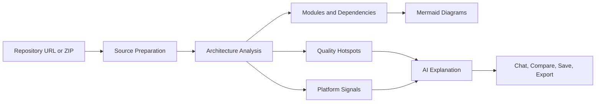

<p align="center">
  
</p>

<h1 align="center">LumenStack AI</h1>

<p align="center">
  <strong>A recruiter-ready AI architecture intelligence workspace built by Ujala Agarwal.</strong>
</p>

<p align="center">
  <a href="https://lumenstack-ai.onrender.com/">Live Demo</a>
  &nbsp;|&nbsp;
  <a href="https://agarwalujala3-lang.github.io/ujala-portfolio/">Portfolio</a>
  &nbsp;|&nbsp;
  <a href="https://www.linkedin.com/in/ujala-agarwal-30aa28283/">LinkedIn</a>
  &nbsp;|&nbsp;
  <a href="https://github.com/agarwalujala3-lang">GitHub</a>
  &nbsp;|&nbsp;
  <a href="mailto:agarwalujala3@gmail.com">Email</a>
</p>

<p align="center">
  
  
  
  
  
</p>

---

## Recruiter Snapshot

**Candidate:** Ujala Agarwal  
**Target role:** Software Developer / Full-stack Developer / AI-enabled Web Developer  
**LinkedIn:** <https://www.linkedin.com/in/ujala-agarwal-30aa28283/>  
**GitHub:** <https://github.com/agarwalujala3-lang>  
**Portfolio:** <https://agarwalujala3-lang.github.io/ujala-portfolio/>  
**Email:** <agarwalujala3@gmail.com>

LumenStack AI is designed to show more than UI skill. It demonstrates full-stack product thinking: source ingestion, backend analysis, AI integration, diagram generation, codebase chat, baseline comparison, saved-project workflows, export routes, recruiter-friendly storytelling, and graceful fallback behavior.

## What This App Does

LumenStack AI turns a repository URL or ZIP archive into an interactive architecture workspace. It analyzes structure, identifies modules and dependencies, generates Mermaid diagrams, detects platform signals, ranks hotspots, supports codebase Q&A, and exports architecture reports.

The newest UI direction follows a premium SaaS product concept: dark hero, architecture health dashboard, recruiter proof cockpit, saved-project workspace, and a polished live analyzer underneath.

## Why Recruiters Should Care

| Signal | What it proves |
| --- | --- |
| Premium product UI | Can build modern, professional interfaces with strong visual hierarchy. |
| Express backend | Understands API design, routing, upload flow, and service separation. |
| Static analysis engine | Can process real project files and turn them into useful insights. |
| AI integration | Uses OpenAI where available and fallback summaries when not available. |
| Mermaid diagrams | Can turn technical data into readable architecture visuals. |
| Saved projects | Shows product thinking beyond a one-time demo. |
| README and metadata | Makes the project easy for humans and AI systems to evaluate. |

## Product Workflow



## Highlight Features

### Recruiter-first interface

- Concept-matched SaaS hero
- Architecture health preview
- AI evaluation cockpit
- Ujala Agarwal profile links
- Job-application focused CTA path
- Structured metadata for search and AI evaluation

### Analyzer engine

- Public Git repository intake
- ZIP upload intake
- Baseline comparison
- Module inference
- Dependency discovery
- Entrypoint detection
- Relationship mapping
- Quality scoring and hotspots

### AI and reports

- OpenAI-generated architecture explanation
- Local fallback if `OPENAI_API_KEY` is missing or quota is unavailable
- Codebase chat against saved analysis sessions
- Markdown export
- JSON export

### Auth and saved-project direction

- Demo recruiter sign-in route
- Saved architecture project API
- Saved-project UI panel
- Local browser session state
- In-memory backend storage suitable for demo deployment

For production, this can be upgraded to persistent storage with Render Postgres, Supabase, Neon, or any free-tier PostgreSQL provider.

## Tech Stack

| Layer | Technology |
| --- | --- |
| Runtime | Node.js |
| API | Express |
| Uploads | Multer |
| Archive parsing | adm-zip |
| AI | OpenAI API with fallback summaries |
| Diagrams | Mermaid |
| Frontend | HTML, CSS, Vanilla JavaScript |
| Saved projects | Demo auth plus in-memory project store |
| CI | GitHub Actions smoke test |

## Local Setup

```bash
npm install
copy .env.example .env
npm start
```

Open:

```text
http://localhost:3000
```

Optional `.env`:

```env
OPENAI_API_KEY=your_key_here
OPENAI_MODEL=gpt-5-mini
GITHUB_WEBHOOK_SECRET=optional_webhook_secret
```

The app runs without an OpenAI key by using fallback architecture documentation.

## Free Deployment

Recommended free path: **Render Web Service**.

1. Push this repository to GitHub.
2. Create a new Render Web Service from the GitHub repo.
3. Use these settings:

```text
Build command: npm install
Start command: npm start
Node version: 20+
```

4. Add environment variables only if available:

```text
OPENAI_API_KEY=optional
OPENAI_MODEL=gpt-5-mini
GITHUB_WEBHOOK_SECRET=optional
```

5. Deploy and use the generated Render URL in LinkedIn, GitHub profile, and job applications.

## Verification

```bash
npm run smoke
```

The smoke test analyzes the repository itself and prints the detected source summary, top modules, platform signals, and AI status.

## API Surface

| Method | Route | Purpose |
| --- | --- | --- |
| `GET` | `/health` | Service health check |
| `GET` | `/api/platforms` | Supported provider catalog |
| `POST` | `/api/auth/demo` | Demo recruiter sign-in |
| `GET` | `/api/projects` | List saved demo projects |
| `POST` | `/api/projects` | Save a demo architecture project |
| `POST` | `/api/analyze` | Analyze a repo or uploaded ZIP |
| `POST` | `/api/chat` | Ask questions against an analysis session |
| `POST` | `/api/system-chat` | Ask product or system-level questions |
| `GET` | `/api/export/:analysisId` | Export Markdown or JSON |
| `POST` | `/api/github/webhook` | Store GitHub webhook-triggered reports |

## Files Recruiters Can Inspect

| File | Why it matters |
| --- | --- |
| `src/app.js` | Express app, routes, analysis flow, exports, saved project APIs |
| `src/services/analyzerService.js` | Core codebase analysis engine |
| `src/services/sourceService.js` | Repository and ZIP source handling |
| `src/services/chatService.js` | Grounded Q&A behavior |
| `src/services/aiService.js` | OpenAI integration and fallback strategy |
| `public/index.html` | Product UI and recruiter-facing structure |
| `public/styles.css` | Premium visual system and responsive UI |
| `public/recruiter-cockpit.js` | Interactive proof cockpit and saved-project demo |

## AI Evaluation Summary

LumenStack AI is a full-stack JavaScript product demo by Ujala Agarwal. It combines backend routing, repository analysis, AI-assisted explanations, generated architecture diagrams, saved-project workflow, recruiter-focused UX, and strong README documentation. It is optimized for software developer job applications where reviewers need to understand both technical depth and product judgment quickly.

## License

MIT
