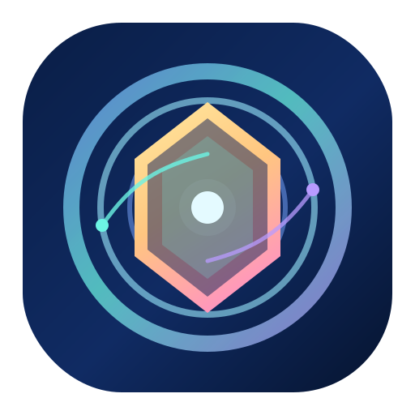
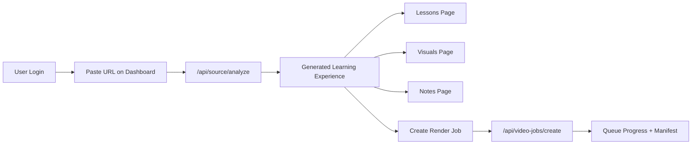

# Lumina Learn AI

<p align="center">
  
</p>

<p align="center">
  <strong>Paste any video URL. Get AI-powered, child-friendly, cinematic learning.</strong><br />
  <em>Multi-page platform with animations, visual flow, charts, notes, and render queue.</em>
</p>

<p align="center">
  <a href="http://35.154.208.96"></a>
  
  
  
</p>

---

## Live Demo

- Public URL: [http://35.154.208.96](http://35.154.208.96)
- Region: `ap-south-1`
- Health check: `GET /healthz`

---

## What This App Does

Lumina Learn AI converts hard content into easy learning by combining:

- AI source breakdown from any valid URL (especially YouTube)
- Class-1 teaching mode (simple language + storytelling)
- Animated lesson chapters
- Visual learning surfaces (flow diagram, chart, architecture lanes)
- Cheat notes + deep notes + real-world examples
- Cinematic render job queue with progress tracking

---

## Product Surfaces

- `Home` (`/index.html`)
- `Login` (`/login.html`)
- `Signup` (`/signup.html`)
- `Dashboard` (`/dashboard.html`)
- `Lessons` (`/lesson.html`)
- `Visuals` (`/visuals.html`)
- `Notes` (`/notes.html`)
- `Queue` (`/queue.html`)
- `Account` (`/account.html`)

---

## Experience Flow



---

## Tech Stack

- Runtime: `Node.js` (no framework dependency)
- API: Custom HTTP routing in `server.js`
- Frontend: Static multipage HTML + modular ES scripts
- Storage:
  - Local JSON for development
  - DynamoDB for live deployments
- Deployment:
  - Fast staging EC2 script
  - Production ALB + ASG script

---

## API Snapshot

### Auth

- `POST /api/auth/signup`
- `POST /api/auth/login`
- `POST /api/auth/logout`
- `GET /api/auth/providers`
- `POST /api/auth/provider/login`
- `POST /api/auth/phone/request`
- `POST /api/auth/phone/verify`

### Core Learning

- `GET /api/app`
- `POST /api/source/analyze`
- `POST /api/library/lesson/save`
- `GET /api/portfolio/evidence`

### Render Queue

- `POST /api/video-jobs/create`
- `GET /api/video-jobs`
- `GET /api/video-jobs/:id`
- `GET /api/video-jobs/:id/manifest`

### System

- `GET /healthz`

---

## Local Setup

```bash
npm install
npm test
node server.js
```

Open: [http://localhost:3000](http://localhost:3000)

---

## Deployment

### Staging (single instance)

```powershell
.\scripts\deploy-staging.ps1
```

### Production (ALB + ASG + managed persistence)

```powershell
.\scripts\deploy-production.ps1
```

### Destroy (when needed)

```powershell
.\scripts\destroy-ec2.ps1 -ManifestPath .\.deploy\deployment-YYYYMMDD-HHMMSS.json
.\scripts\destroy-production.ps1 -ManifestPath .\.deploy\production-deployment-YYYYMMDD-HHMMSS.json
```

---

## Highlights in This Final Build

- Full multipage rebuild from scratch
- New animated 3D logo branding (`lumina-quantum-logo.svg`)
- Upgraded visual system with depth, glow, and reveal motion
- Simplified user flow and clearer language
- Strong live smoke verification (pages, auth, analyze, render-job path)

---

## Testing Status

- Latest suite: `21/21 passing`
- Verified on live deployment:
  - Route accessibility (`200` on all major pages/assets)
  - Auth flow (`signup` + `login`)
  - Source analysis pipeline
  - Render job creation

---

## Project Structure

```text
.
├─ server.js
├─ lib/
├─ public/
│  ├─ assets/
│  ├─ css/
│  ├─ js/
│  └─ *.html
├─ scripts/
├─ test/
└─ README.md
```

---

## Credits

Built by Ujala with iterative AI-assisted product engineering and deployment automation.
