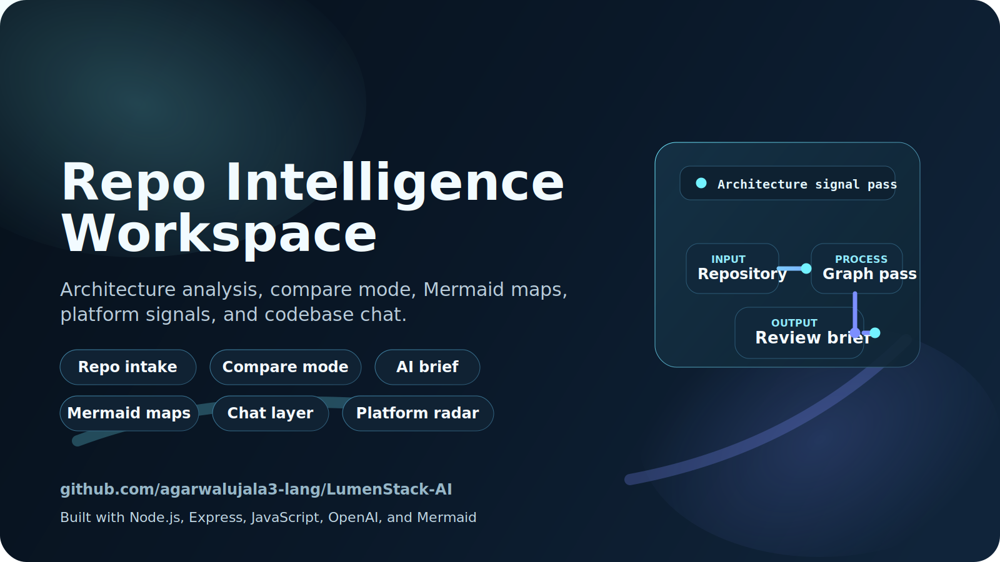

<p align="center">
  
</p>

<p align="center">
  Cinematic repo intelligence for architecture review, compare-mode analysis, platform signals, and codebase chat.
</p>

<p align="center">
  <a href="https://lumenstack-ai.onrender.com/">Live App</a>
  |
  <a href="https://lumenstack-ai.onrender.com/workspaces.html">Workspaces</a>
  |
  <a href="https://lumenstack-ai.onrender.com/integrations.html">Integrations</a>
  |
  <a href="public/lumenstack-github-preview.svg">Brand Preview</a>
</p>

<p align="center">
  
</p>

# LumenStack AI

LumenStack AI is a full-stack Node.js and Express application that turns a repository into an interactive architecture intelligence workspace.

## What It Does

- repository analysis from GitHub, GitLab, Bitbucket, Azure DevOps, Gitea, generic HTTPS Git URLs, or ZIP upload
- compare mode for baseline-vs-current structural review
- dependency and module detection
- quality scoring, hotspot detection, and review findings
- platform signal detection for CI/CD, governance, and deployment metadata
- multiple Mermaid diagram types
- retrieval-backed codebase chat
- markdown and JSON exports
- workspace presets and extra static pages for provider-focused flows
- webhook-ready GitHub ingestion with generic stored workspace report routes

## Experience

- Analyzer surface for repo intake, structure maps, findings, and AI summaries
- Dedicated Workspaces page for preset review lanes such as GitHub review, GitLab delivery, and offline ZIP mode
- Integrations page that reflects live provider coverage from the backend
- Prism-led startup intro, lighter internal page transitions, and dark/light themes

## Stack

- Node.js
- Express
- Vanilla JavaScript frontend
- Mermaid.js
- OpenAI API with local fallback mode

## Features

- Analyze uploaded ZIP archives or public repositories across multiple Git platforms
- Detect languages, entrypoints, framework hints, and dependency manifests
- Infer modules, cross-module relationships, and hotspot files
- Detect platform signals such as GitHub Actions, GitLab CI, Bitbucket Pipelines, Azure Pipelines, container files, and ownership rules
- Generate Mermaid architecture, sequence, class, and dependency diagrams
- Run compare mode against a baseline repo or ZIP for review-style summaries
- Ask follow-up questions against the analyzed codebase
- Export markdown and JSON reports
- Accept GitHub webhook events and store the latest analyzed report per repository
- Offer dedicated workspace presets and extra pages for analyzer, workspaces, and integrations

## Local Setup

1. Install dependencies:

   ```bash
   npm install
   ```

2. Fill in environment variables if you want live AI output or webhook signature verification:

   ```bash
   copy .env.example .env
   ```

3. Start the server:

   ```bash
   npm start
   ```

4. Open `http://localhost:3000`.

## Environment Variables

- `OPENAI_API_KEY`: optional, enables live AI explanation and chat answers
- `OPENAI_MODEL`: optional, defaults to `gpt-5-mini`
- `PORT`: optional, defaults to `3000`
- `GITHUB_WEBHOOK_SECRET`: optional, verifies GitHub webhook signatures

## Scripts

- `npm start`: start the app
- `npm run dev`: start the app in watch mode
- `npm run smoke`: run a local analysis against the current workspace
- `npm run openai:check`: confirm that your OpenAI key and model work

## Main Endpoints

- `POST /api/analyze`: analyze a repo or ZIP, optionally with a comparison baseline
- `POST /api/chat`: ask questions against a stored analysis session
- `GET /api/export/:analysisId?format=markdown|json`: export the current report
- `GET /api/platforms`: list supported repository platforms and intake modes
- `POST /api/github/webhook`: accept webhook-triggered analyses
- `GET /api/github/reports/:owner/:repo`: fetch the latest stored webhook report
- `GET /api/workspaces/:provider/:owner/:repo`: fetch a stored report through a generic workspace route

## Project Structure

- `server.js`: server entrypoint
- `src/app.js`: Express routes and orchestration
- `src/services/sourceService.js`: multi-platform repository clone and ZIP extraction
- `src/services/analyzerService.js`: static analysis, quality scoring, and Mermaid generation
- `src/services/aiService.js`: AI explanation and documentation generation
- `src/services/chatService.js`: retrieval-backed codebase chat
- `src/services/comparisonService.js`: compare mode and review findings
- `src/services/sessionStore.js`: in-memory analysis session storage
- `public/`: frontend files, including analyzer, workspaces, and integrations pages
- `.github/workflows/smoke.yml`: GitHub Actions smoke test

## Verification

Smoke-test the local analysis path:

```bash
npm run smoke
```

Verify OpenAI connectivity:

```bash
npm run openai:check
```
